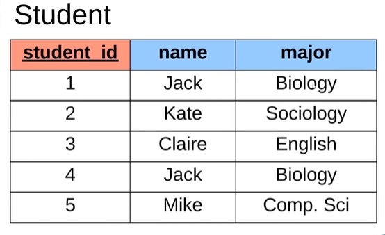
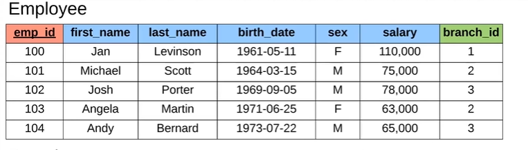
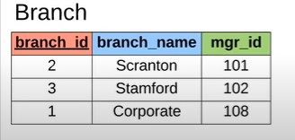

# Tables

First we need to understand we have rows and columns, being row in the horizontal and column in the vertical.

## Primary Keys
To give a unique identification to different data we have the primary keys, in this case the student_id.

We can see its usefulness when we have a lot of data and we have the same names and grades as the example of Jack above.

It doesn't necessarily have to be a number, the primary keys can be a string too.

## Foreign Keys

With a foreign key we can relation 2 or more tables, you can understand better with this example:

### First we have the "primary" table, and we can see he has another id, its the foreign key:

### And we have the branch table, linked to the foreign key:
